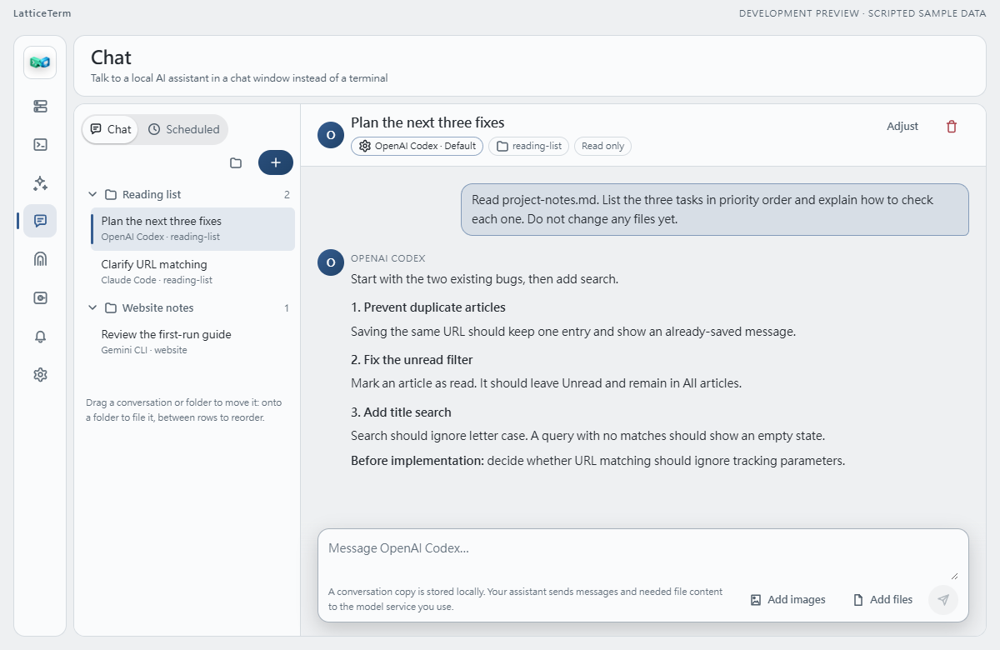

# LatticeTerm

**Your AI assistants and remote connections, in one workspace.**

Use your preferred AI assistants to write code, review changes, or organize information.
LatticeTerm brings sessions from different assistants and remote connections into one desktop workspace,
organized by project so you can switch tools and pick up where you left off.

**[Download](https://github.com/NickYCLin/lattice-term/releases/latest)** · [Get started](#get-started) · [繁體中文](README.md) · [Docs](docs/README.md)

Windows · macOS · Linux | Open-source desktop core, licensed under MPL-2.0



*Development UI preview with fictional projects and a scripted sample conversation. Check release notes for the features in your installer.*

## Keep track of the work across your projects

<table>
  <tr>
    <td width="50%" valign="top">
      <h3>Organize by project</h3>
      <p>Group sessions from different assistants in folders, each with its own terminal output. Return from the sidebar, or open another CLI and choose to hand over the current conversation.</p>
    </td>
    <td width="50%" valign="top">
      <h3>Choose terminal or chat</h3>
      <p>Agent Fleet keeps each tool's original terminal interface. Chat offers message threads, tool output cards, and file attachments. Use your existing assistant login in the interface you prefer.</p>
    </td>
  </tr>
  <tr>
    <td width="50%" valign="top">
      <h3>Continue on a remote host</h3>
      <p>Manage SSH connections, transfer files over SFTP, and create SSH tunnels. Use RDP, VNC, or Lattice Remote for desktop access. Remote connections work independently of AI tools.</p>
    </td>
    <td width="50%" valign="top">
      <h3>Schedule recurring work</h3>
      <p>Set a schedule and return to the results. Agent sessions can stay in the local background service after you close the window, ready to reconnect when you open LatticeTerm again.</p>
    </td>
  </tr>
</table>

## Supported AI tools

Agent Fleet supports **13 local CLIs**: Codex, Claude Code, Gemini CLI, Google Antigravity CLI, OpenCode,
GitHub Copilot CLI, Hermes Agent, Cursor Agent, Aider, Qwen Code, Kimi Code CLI, Factory Droid, and Grok CLI.

**Chat** currently supports Codex, Claude Code, and Gemini CLI; Claude and Codex can ask for approval
before individual tool calls. Available models depend on each tool and your account. Choose any supported
assistant for writing, reviewing, or other tasks.

[Explore the features and limitations →](docs/FEATURES.zh-TW.md) (Traditional Chinese)

## Download

Choose an installer from **[the latest release](https://github.com/NickYCLin/lattice-term/releases/latest)** under Assets:

| Your computer | File to choose |
| --- | --- |
| Windows x64 | Ends in `_x64-setup.exe` |
| Mac, Apple Silicon | Ends in `_aarch64.dmg` |
| Mac, Intel | Ends in `_x64.dmg` |
| Linux x64 | `amd64.deb`, `x86_64.rpm`, or `amd64.AppImage` |
| Linux ARM64 | `arm64.deb`, `aarch64.rpm`, or `aarch64.AppImage` |

LatticeTerm is in public beta, with desktop as its primary experience. Mobile builds have a smaller feature set.
The main branch can contain unreleased work; check the [release notes](https://github.com/NickYCLin/lattice-term/releases).
You can switch the interface to English in **Settings**.

## Get started

**Have one supported AI CLI installed and signed in.** No separate LatticeTerm account is required.
Model subscriptions and API charges remain with the provider you use.

1. Open **AI Agent Fleet** and choose a detected assistant. If a tool is missing, its card offers installation instructions.
2. Create an empty folder and save [project-notes.md](examples/first-session/project-notes.md) in it.
   Select that folder as the working directory and start the assistant.
3. When the assistant's input prompt appears, paste:

   ```text
   Read project-notes.md and list the three tasks in priority order.
   Describe an observable acceptance check for each task.
   Reply in English. Do not change any files yet.
   ```

After the reply arrives, switch away and return using the sidebar. The terminal output stays with that session.
If you have another assistant installed, ask it which requirements still need clarification.
The two sessions keep their results separately so you can compare them.

For SSH or SFTP only, go straight to **Connections**. No AI CLI is required.
[Stuck on your first run?](https://github.com/NickYCLin/lattice-term/issues/new?template=first-run.yml)

## Common questions

**What does this add if I already use Codex or Claude Code?**

A desktop workspace for organizing assistants, projects, sessions, and remote connections.
Each CLI still provides its own authentication, model access, and tools.

**How are Chat and Agent Fleet different?**

Chat is for reading messages, attaching files, and viewing tool results. Agent Fleet provides native terminal
interaction and supports more CLIs. Chat is still being expanded; the
[Codex Desktop comparison](docs/CHAT_DESKTOP_PARITY.zh-TW.md) (Traditional Chinese) tracks implemented and missing features.

**Where does my data go?**

Workspace settings and a local copy of conversations stay on your computer. Your CLI and model provider
may receive prompts and file content needed for a task. Remote connection passwords can be saved,
at your choice, in the OS credential store or a local encrypted vault.
See the [storage and security design](docs/STORAGE_SECURITY_DECISION.zh-TW.md) for details.

**Does Lattice Remote need a server?**

Local-network pairing can connect directly. Connections by device ID across networks need a self-hosted
`lattice-relay`. A hosted team service is not currently provided.
See the [relay setup guide](docs/RELAY_SERVER.zh-TW.md).

## Documentation and contributions

Detailed engineering guides are currently in Traditional Chinese:

- [Features, limitations, and keyboard shortcuts](docs/FEATURES.zh-TW.md)
- [Local development and verification](docs/DEVELOPMENT.zh-TW.md)
- [Source and documentation map](docs/README.md)

Report bugs or suggest improvements in [Issues](https://github.com/NickYCLin/lattice-term/issues).
Include your app and CLI versions, the steps you took, and the expected and actual result.
Remove credentials, private hosts, and account information from screenshots.

Code, documentation, and translation contributions are welcome. See [Contributing](CONTRIBUTING.md).
Report vulnerabilities privately through the [security policy](SECURITY.md).

[MPL-2.0 license](LICENSE) · [Trademarks](TRADEMARKS.md)
