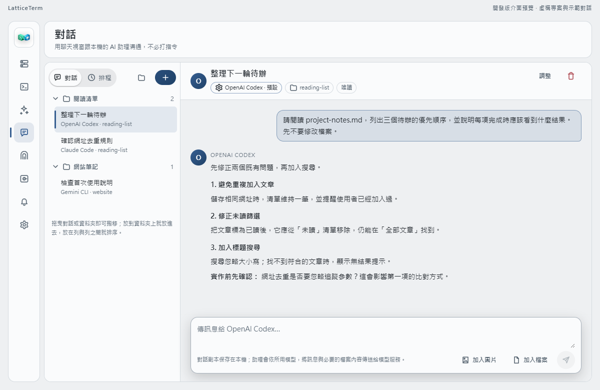

# LatticeTerm

**AI 助理與遠端連線，一個工作區。**

使用你習慣的 AI 助理撰寫程式、檢查修改或整理資料。
LatticeTerm 把不同助理的工作階段與遠端連線放在同一個桌面工作區，按專案整理，方便切換與接續工作。

**[下載桌面版](https://github.com/NickYCLin/lattice-term/releases/latest)** · [開始使用](#開始使用) · [English](README.en.md) · [文件](docs/README.md)

Windows · macOS · Linux ｜ 桌面核心開源，採 MPL-2.0 授權



*開發版介面預覽，使用虛構專案與預先編寫的範例對話；實際功能以下載版本的更新說明為準。*

## 工作多了，也找得到每個進度

<table>
  <tr>
    <td width="50%" valign="top">
      <h3>整理工作階段</h3>
      <p>把不同助理的工作階段放進資料夾，各自保留終端內容。從側欄切回任務，需要交接時可加開另一個 CLI，選擇帶入目前對話。</p>
    </td>
    <td width="50%" valign="top">
      <h3>終端與對話</h3>
      <p>Agent Fleet 保留工具原本的終端操作；對話頁提供訊息串、工具執行卡片與檔案附件。沿用已登入的助理，選擇習慣的操作方式。</p>
    </td>
  </tr>
  <tr>
    <td width="50%" valign="top">
      <h3>連線與傳檔</h3>
      <p>管理 SSH 連線、用 SFTP 傳檔、建立 SSH Tunnel。需要看桌面時，另有 RDP、VNC 與 Lattice Remote；也能單獨使用遠端連線。</p>
    </td>
    <td width="50%" valign="top">
      <h3>排程與背景工作</h3>
      <p>為固定任務設定排程，回來查看執行結果。Agent 工作階段可選擇留在本機背景服務，關閉視窗後繼續執行，下次開啟再接回；也能把它們分享給支援 MCP 的外部 AI 工具唯讀查看。</p>
    </td>
  </tr>
</table>

## 支援的 AI 工具

Agent Fleet 支援 **13 種本機 CLI**：Codex、Claude Code、Gemini CLI、Google Antigravity CLI、OpenCode、
GitHub Copilot CLI、Hermes Agent、Cursor Agent、Aider、Qwen Code、Kimi Code CLI、Factory Droid 與 Grok CLI。

**對話模式**目前支援 Codex、Claude Code 與 Gemini CLI；Claude 和 Codex 可在工具執行前逐項詢問。
各工具可用的模型取決於其自身支援與你的帳號，你可以依任務選擇助理。

[查看完整功能與限制 →](docs/FEATURES.zh-TW.md)

## 下載

到 **[最新版本](https://github.com/NickYCLin/lattice-term/releases/latest)** 的 Assets 選擇安裝檔：

| 你的電腦 | 選擇的檔案 |
| --- | --- |
| Windows x64 | 結尾為 `_x64-setup.exe` |
| Mac，Apple Silicon | 結尾為 `_aarch64.dmg` |
| Mac，Intel | 結尾為 `_x64.dmg` |
| Linux x64 | `amd64.deb`、`x86_64.rpm` 或 `amd64.AppImage` |
| Linux ARM64 | `arm64.deb`、`aarch64.rpm` 或 `aarch64.AppImage` |

目前為公開測試階段，以桌面版為主。行動版進度與限制見 [功能現況](docs/FEATURES.zh-TW.md#完成度總覽)。
主分支可能包含未發布功能；請對照 [Release 更新說明](https://github.com/NickYCLin/lattice-term/releases)。

## 開始使用

**先準備一個已安裝、已登入的 AI CLI。** LatticeTerm 不要求另註冊帳號，模型訂閱或 API 費用由原服務計算。

1. 開啟 **AI Agent Fleet**，選擇已偵測到的助理。尚未安裝時，卡片會提供安裝入口。
2. 建立空資料夾，放入 [範例筆記](examples/first-session/project-notes.md)，選它作為工作目錄並啟動助理。
3. 等助理的輸入畫面出現，貼上這段話：

   ```text
   請閱讀 project-notes.md，列出三個待辦的優先順序，
   並說明每項完成時應該看到什麼結果。先不要修改檔案。
   ```

看到回覆後，從側欄切到別處再切回，原本的終端內容仍在。
如果還有第二個助理，可以對同一份筆記問：「有哪些需求還需要先確認？」
兩個工作階段會分別保留結果，方便比較。

[完整第一次使用步驟](docs/FIRST_RUN.zh-TW.md) · [使用卡住了？](https://github.com/NickYCLin/lattice-term/issues/new?template=first-run.yml)

## 常見問題

**我已經在用 Codex 或 Claude Code，LatticeTerm 多做了什麼？**

它提供桌面工作區，把助理、專案、工作階段與遠端連線整理在一起。
登入、模型存取與工具本身的能力仍由各 CLI 提供。各工具支援範圍見 [功能文件](docs/FEATURES.zh-TW.md#主要特色)。

**對話頁和 Agent Fleet 有什麼差別？**

對話頁適合閱讀訊息、附加檔案及查看工具結果；Agent Fleet 適合需要原生終端互動或使用其他 CLI 的工作。
對話頁正在持續擴充，[Codex Desktop 功能對照](docs/CHAT_DESKTOP_PARITY.zh-TW.md) 列出現況與待補項目。

**資料存在哪裡？**

工作區設定與對話的本機複本保存在這台電腦。助理會依你使用的 CLI 和模型服務傳送提示與必要的檔案內容。
遠端連線的密碼可由你選擇保存在系統認證儲存區或本機加密保管庫。
詳細處理方式見 [儲存與安全設計](docs/STORAGE_SECURITY_DECISION.zh-TW.md)。

**Lattice Remote 需要額外服務嗎？**

區網可直接配對。跨網路使用裝置 ID 連線時，需要自架 `lattice-relay` 中繼；
目前沒有提供託管團隊服務。[中繼部署說明](docs/RELAY_SERVER.zh-TW.md)

## 文件與參與

| 想做什麼 | 從這裡開始 |
| --- | --- |
| 安裝後完成第一個任務 | [第一次使用](docs/FIRST_RUN.zh-TW.md) |
| 查看支援範圍、快捷鍵及後續方向 | [功能與限制](docs/FEATURES.zh-TW.md) |
| 建置、測試或修改程式 | [本地開發](docs/DEVELOPMENT.zh-TW.md) · [程式碼導覽](docs/README.md) |
| 提出問題或建議 | [Issues](https://github.com/NickYCLin/lattice-term/issues) · [首次使用回饋](https://github.com/NickYCLin/lattice-term/issues/new?template=first-run.yml) |
| 貢獻程式、文件或翻譯 | [參與方式](CONTRIBUTING.md) |

回報問題時，請附上版本、操作步驟，以及預期與實際結果；截圖先移除帳號、私有主機與憑證資訊。
安全漏洞請依 [安全性政策](SECURITY.md) 私下通報。

[MPL-2.0 授權](LICENSE) · [商標與名稱規範](TRADEMARKS.md)
