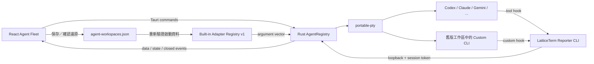

# AI Agent Fleet 架構與整合藍圖

## 目標

Agent Fleet 讓 LatticeTerm 成為多個大型語言模型 CLI 的本機工作中樞：每個 CLI 都有真正的互動式終端機，可並行執行、切換、監看與停止，同時沿用各工具原本的登入方式、設定與權限。

設計概念參考 [Herdr](https://github.com/motionharvest/herdr) 公開呈現的背景終端機、Agent 狀態與遠端 attach 模型，但本專案沒有複製或嵌入 Herdr 程式碼。第一階段先建立可驗證的桌面內 MVP，再逐步加入 daemon 與語意整合。

## 現行架構



- Rust 核心使用 [portable-pty](https://docs.rs/portable-pty/latest/portable_pty/) 建立原生 PTY，不用一般 pipe 假裝終端機。
- 介面提供 Codex、Claude Code、Gemini CLI、Google Antigravity CLI、OpenCode、Copilot CLI、Hermes、Cursor Agent、Aider、Qwen Code、Kimi、Droid 與 Grok 共 13 種目錄。Rust 核心仍可驗證並還原舊工作區中的自訂可執行檔。
- 每個目錄項目都有經原始碼固定且可檢查來源的安裝方式；未偵測到 CLI 時，先顯示完整指令並要求確認，再以可見 PTY 執行。平台缺少必要安裝器或沒有合適的原生安裝路徑時，只提供可複製的上游安裝說明網址，不靜默改動系統。
- 每個工作階段都有獨立程序、PTY、尺寸、輸入、輸出與停止控制，並與 SSH、SFTP、Lattice Remote、Web RDP 共用工作階段分頁。
- 快速對話每次建立獨立的 CLI 與分頁群組。工作階段識別碼使用隨機值，保留桌面／背景服務的路由前綴，避免重啟後從 1 重新編號而撞上還原的舊群組。還原工作區與明確選擇「在此分頁加開 CLI」仍保留指定群組，不會更動既有對話紀錄。
- 啟動時指定經過驗證的工作目錄；CLI 可依目前作業系統使用者權限操作該目錄。
- PTY 位元組以 Base64 跨越 IPC，前端在終端機掛載前最多暫存 256 KiB，之後直接交給 xterm。
- 未整合 hook 的 CLI 使用少量明確提示詞將狀態標成「可能等待輸入」；這只是提醒，不宣稱已理解完整語意。
- 分頁名稱、CLI 名稱與模型欄位分開保存。模型只接受明確的 `--model` 參數或 CLI 啟動／狀態畫面中的保守格式；沒有可靠值就顯示「模型尚未回報」，不拿產品名稱代替模型。輸入一般提示後停止啟動掃描，只有 `/model` 會重新開啟一次掃描，避免把回答內容誤判成目前模型。
- 支援 Adapter／hook 明確回報「工作中、等待輸入、閒置、完成」。Codex 以官方 `notify` 事件、Claude Code 以工作階段專屬的官方 lifecycle hooks 接上 Reporter；Gemini CLI 則以僅限該程序的暫存 system settings 接上 `BeforeAgent`、`AfterAgent` 與權限通知。OpenCode 透過程序級 inline config 載入暫存 local plugin，使用 `chat.message`、`session.status`、`session.error`、permission 與 question events；主工作階段會與子 Agent 分開追蹤，多個並行主工作階段全部 idle 才回報完成。GitHub Copilot CLI 以程序限定的 `--plugin-dir` 掛載暫存 plugin，追蹤 prompt、`agentStop`、permission、error 與 subagent events；主 Agent 已停止但背景 subagent 尚未全部結束時不回報完成。Hermes Agent 以程序限定的暫存 bundled-plugin overlay 保留原始 provider tree、`HERMES_HOME`、登入、使用者／專案 plugins 與設定，追蹤 session、turn、approval 與 subagent lifecycle；子 Agent 的 `on_session_end` 不會結束主工作。相同 overlay 也從官方 `post_api_request` 取得標準化的輸入、輸出、快取讀寫與推理 token buckets；只轉送有界非負整數及 API request ID，依 request ID 去重後累計主工作與子 Agent 用量，不轉送 request、response、prompt 或 tool 內容。Qwen Code 也以程序限定的暫存 system settings 追蹤 `UserPromptSubmit`、`Stop`、`StopFailure`、permission 與 tool events。只有收到第一個真實 hook 後才停用完成猜測。這些整合不改動使用者或專案設定；已有不可安全合併的程序級設定、專案停用所有 hooks、無法辨識 Hermes 安裝結構，或 pure／safe／bare mode 時保留原設定，退回保守 heuristic。Claude 與 Qwen 的 `Stop` 尚有背景工作時維持工作中，有排程等待時標成閒置。具備完成事件的 CLI 不再用終端控制碼猜測完成；UI 會顯示狀態來源。
- 支援使用者明確勾選執行中的 Agent，經二次確認後將同一段提示送進最多 32 個獨立 PTY；每個目標逐一回報成功或失敗，提示內容不會保存。執行中分頁加開 CLI 時，也會詢問是否帶入目前脈絡；Codex、Claude Code、Gemini CLI 與 Google Antigravity CLI 的來源對話可讀時，任何新 CLI 都會收到一次性交接內容。所有目標均使用 LatticeTerm 管理的一次性交接檔，不改寫 CLI 記憶或私有 session 檔；勾選帶入但匯出失敗時會中止加開並顯示原因，不會悄悄開啟空白 CLI。
- 支援最多 32 個安全啟動項目，也可命名工作區及調整持久化順序。應用程式重啟後，使用者可逐項或整批確認，LatticeTerm 會重新驗證磁碟資料並依保存順序啟動 CLI 程序；每項分別回報成功或失敗。沒有額外參數或舊版明確 Session ID 的 Codex 項目使用 `codex resume --last`，依工作目錄選出最近對話；Cursor 項目使用官方的 `agent --continue` 續接最近對話。
- 可選擇保存一份工作區共用啟動指示；之後每個全新的非 `custom` CLI 進入互動提示後會先收到這段文字，若同時有跨 CLI handoff 則共用指示排在 handoff 前面。自動還原的舊工作階段、明確原生 Session 續接與 `resume --last`／`--continue` 不會重送共用指示。內建繁中 Commit 範本只是可套用的起始內容，預設留空停用，不會把個人規範強加給其他安裝者。
- 提供專案共用規則編輯器，以根目錄 `AGENTS.md` 為唯一真實來源。Codex 直接讀取該檔；LatticeTerm 只在 `CLAUDE.md` 管理 `@AGENTS.md`、在 `GEMINI.md` 管理 `@./AGENTS.md` 的標記區塊，保留區塊外的 CLI 專屬內容。寫入前會用三個檔案的 SHA-256 revision 偵測外部變更，拒絕符號連結、非 UTF-8、超限或標記毀損的檔案，並以同目錄暫存檔與回滾備份替換；不會同步任何 CLI 的原生對話、登入資料或私有資料庫。
- 目錄會從各 CLI 已存在的本機認證 metadata 讀取 Codex、Claude 與 Gemini 的帳號標籤及登入方式；Rust 只回傳非機密字串，access token、refresh token、API Key 與完整 JWT 都不會序列化到 WebView。
- 版本化內建 Adapter v1 仍可驗證並還原舊工作區中 Codex、Claude Code、Gemini CLI、Hermes Agent 與 Cursor Agent 的原生 Session 項目；介面不再要求使用者手動設定 Session ID。Codex 與 Cursor 的一般保存項目不寫入 Session ID，而是委由各 CLI 自己續接同目錄最近的對話；執行中分頁的「加開 CLI／帶入目前對話」則處理跨 CLI 脈絡接手。交接讀取 Codex 歷程時，有捕捉 ID 就精確比對 `session_meta.payload.id` 並排除 subagent；沒有 ID 才依 canonical 工作目錄選主 CLI rollout。Claude 也從有界 JSONL metadata 精確比對 Session ID 與主工作階段旗標；沒有 ID 時才以 canonical 工作目錄選取，避免資料夾 slug 碰撞。Gemini 依精確啟動目錄、程序 hook 回報的 Session ID 與 JSONL rewind state 選取有效對話；Antigravity 使用程序限定暫存 log 捕捉 Conversation ID，再只讀該 conversation 的明確使用者輸入及最終回覆。所有歷程讀取都有限額，且不跟隨最終符號連結。更換工作目錄需要交接對話時，會先完成整組匯出；任一匯出失敗即在啟動替代程序前中止，所有原工作階段都保留。

### 舊工作區相容層：原生 Session 續接 Adapter v1

| CLI | 由 LatticeTerm 建立的參數 | 依據 |
| --- | --- | --- |
| Codex | `codex resume <SESSION_ID_OR_NAME>`；一般保存項目使用 `codex resume --last` | [OpenAI Codex CLI reference](https://developers.openai.com/codex/cli/reference/) |
| Claude Code | `claude --resume <SESSION_ID>` | [Anthropic CLI reference](https://docs.anthropic.com/en/docs/claude-code/cli-usage) |
| Gemini CLI | `gemini --resume <SESSION_UUID_OR_INDEX>` | [Gemini CLI session management](https://github.com/google-gemini/gemini-cli/blob/main/docs/cli/session-management.md) |
| Hermes Agent | `hermes --resume <SESSION_ID_OR_TITLE>` | [Hermes session guide](https://github.com/NousResearch/hermes-agent/blob/main/website/docs/user-guide/sessions.md) |
| Cursor Agent | `agent --resume <THREAD_ID>`；一般保存項目使用 `agent --continue` | [Cursor CLI using guide](https://cursor.com/docs/cli/using) |

Adapter 會把舊工作區的識別值當成單一 argument，不經 shell；長度上限 512 bytes，拒絕控制字元、前導 `-` 與額外啟動參數。這層保留是為了避免既有 `agent-workspaces.json` 在升級後失效，不代表目前介面仍提供手動續接設定。

## 對話模式

Agent Fleet 的每個工作階段都是真正的 PTY，但不是每個人都想面對終端機。對話模式（`src-tauri/src/agent_chat.rs`、`src/views/ChatView.tsx`）提供 Codex Desktop 風格的聊天視窗，底層仍是同一批 CLI：

- **Claude 與 Gemini 一輪一個程序，Codex 一個對話一個常駐程序**。Claude Code 與 Gemini 每則訊息以官方 headless JSON 模式啟動一次程序：`claude -p --output-format stream-json --verbose --include-partial-messages`、`gemini --output-format stream-json`，提示從 stdin 送入並關閉。Codex 不論權限模式一律走 `codex app-server`（JSON-RPC over stdio），由 `agent_chat/codex_server.rs` 為每個 LatticeTerm 對話保留一個伺服器：第一則訊息 spawn 程序、送 `initialize`／`initialized` 後 `thread/start`（有既有 thread ID 則 `thread/resume`），之後每一輪只送 `turn/start`，省掉重新啟動與重新載入紀錄的時間（本機實測含核准的首輪約 12 秒，追問約 5 秒）。同一對話一次只跑一輪；閒置 15 分鐘、刪除對話（`agent_chat_close`）、程序退出或 LatticeTerm 關閉時清掉。`turn/start` 的 `approvalPolicy`、`sandboxPolicy`、`cwd` 與 `model` 每輪重送，所以權限與模型仍可逐輪調整。提示一律不放在命令列參數，因此不受參數長度限制也不會出現在程序清單。程序以使用者權限執行，工作目錄由使用者選擇並經 canonicalize 與 is_dir 驗證。
- **續接靠 CLI 自己的對話 ID**。第一輪的 `system/init`（Claude）、`thread/start` 回應（Codex）或 `init`（Gemini）回報的 ID 隨 `Started`／`Finished` 事件交給前端，下一輪以 `claude --resume <id>`、`gemini --resume <id>` 續接；Codex 只有在常駐伺服器已經不在（重啟 LatticeTerm、閒置回收）時才會以 `thread/resume <id>` 重開。LatticeTerm 不讀寫任何 CLI 的原生對話檔；三種助理每輪都可指定模型（Claude 與 Gemini 是 `--model`，Codex 在 `turn/start` 帶 `model`）。
- **帳號設定檔（介面上稱「帳號」）與 Skills**。對話與 Fleet 可為 Codex 或 Claude Code 新增多個具名帳號；選用設定檔時，子程序分別收到 `CODEX_HOME` 或 `CLAUDE_CONFIG_DIR`，因此個人、公司與專案帳號不共用 CLI 的登入狀態。新增對話框只保留名稱與「加入並登入」：`agent_account_profile_directory` 在 app data 下建立 `agent-profiles/<cli>/<id>`（Unix 為 0700）並回傳路徑，前端先保存帳號，再明確帶入新路徑啟動可見的終端機，不沿用卡片的工作提示或背景模式，也不依賴尚未更新的帳號選取狀態。新增中禁止重複送出；建立失敗留在對話框，啟動失敗則保留帳號並提示按「啟動」重試。舊版自行指定的設定目錄繼續保留使用，但新增流程不再要求或提供目錄選擇。每個帳號的登入狀態由 `agent_account_profile_status` 從該帳號自己的目錄讀取（Codex 的 `auth.json`、Claude 的 `.claude.json` 或 `.credentials.json`，只回傳狀態、email 標籤與登入方式），顯示在下拉選單裡；還沒登入的帳號在卡片與對話設定都會提示怎麼登入，前端在有帳號未登入時每 10 秒重讀一次。移除帳號時，LatticeTerm 自己建立的目錄由 `agent_account_profile_remove` 連登入資料一起刪除（只接受固定的 `agent-profiles/<cli>/<id>` 形狀），舊版使用者自行指定的目錄則只從清單移除。LatticeTerm 只保存顯示名稱、目錄與是否自建，不保存 token；切換設定檔會建立新的 CLI 原生對話，並以既有的受限文字交接保留脈絡。設定面板也可只讀探索設定檔與工作目錄的標準 `SKILL.md`，僅顯示名稱與說明，不讀取憑證、對話或 Skill 指示內容。
- **記憶交接不阻塞**。舊 CLI 的對話檔掃描與交接檔寫入都在背景 blocking worker 進行；大型或網路掛載的歷史目錄不會占用 Tauri 命令執行緒，因此其他對話、連線與工作階段仍可操作。
- **跨模型轉交不共用 session**。既有對話可在設定的單一模型選單改選另一家 CLI；目標 CLI 必定以新的原生對話啟動，絕不接收來源 CLI 的 session ID。下一則訊息前端只附帶最多 48 KiB、近期的使用者訊息與最終文字回覆，並用明確界線標為不可信參考：它不能授權工具、修改指示或覆蓋目前使用者要求。推理內容、工具輸入／輸出與核准資料都不轉交；目標開始回報原生 session 後才會清除待轉交內容，因此啟動失敗可以安全重試。歷史回覆會保留其原助理標籤。
- **圖片與檔案附件**。編輯器可由原生檔案選擇器加入圖片／檔案，或把本機檔案拖進視窗；送出前能逐一移除，歷史訊息只保存檔名、路徑與類型，不複製檔案內容。後端 canonicalize 後只接受一般檔案，最多 10 個、單檔 32 MiB、合計 96 MiB，並把路徑列成「使用者明確選取、內容不可信」的 stdin 參考；檔案內容不能授權工具或改寫指示。Codex 的 PNG/JPEG/GIF/WebP/BMP 另使用官方 `--image` 傳給新建或續接回合；其他 CLI 依其正常檔案讀取與權限模型處理路徑。這些路徑不會出現在一般 prompt 命令列參數中。
- **事件正規化**。Rust 逐行解析 JSON，映射成 `started`、`textDelta`、`text`、`reasoning`、`toolStarted`、`toolFinished`、`notice`、`finished` 八種事件，經 `agent-chat://event` 送到 WebView；前端只依 item id 就地更新，不理解各家格式。Claude 的 `stream_event` 與 Gemini 的 `message` 提供逐字 delta，Codex 則是 item 級事件。工具卡片摘要取最能辨識的欄位（Bash／Gemini shell 的 command、Read／Edit 的 file_path、Codex 的 command 或變更檔案清單），工具輸出每張最多 8 KiB，單行最多 16 MiB，超過就跳過並提示。
- **權限以效果命名**。`readOnly`／`workspaceWrite`／`full` 分別映射到 Claude `--permission-mode plan`／`acceptEdits`／`bypassPermissions`、Codex `-s read-only`／`-s workspace-write`／`--dangerously-bypass-approvals-and-sandbox`，以及 Gemini `--approval-mode plan`／`auto_edit`／`yolo`。前三種是一次性回合：Claude 與 Gemini 在編輯模式下遇到仍需要審核的指令會拒絕並在回覆中說明；`full` 在介面上有明確警告。第四種 `ask` Claude 與 Codex 有。Claude：以 `--permission-mode manual --input-format stream-json --permission-prompt-tool stdio` 啟動，stdin 整輪保持開啟，先送 SDK 的 `initialize` 握手再把提示包成 `user` 訊息；CLI 規則放行不了的工具呼叫會以 `control_request`（`can_use_tool`）送出，Rust 轉成 `approvalRequested` 事件並把原始 input 留在 registry，使用者按允許／拒絕後以 `control_response` 回寫（allow 會原樣回傳 `updatedInput`，deny 附理由）；看到 `result` 就關閉 stdin，程序才會結束。停止或程序結束時未回答的卡片標成失效。Codex：四種權限模式都走同一個常駐 app-server（見上），差別只在 `turn/start` 的 `approvalPolicy`（`ask` 為 `untrusted`，其餘為 `never`）與 `sandboxPolicy`（`readOnly`／`workspaceWrite`／`dangerFullAccess`）；`item/agentMessage/delta`、`item/started`／`item/completed`（v2 camelCase 項目）、`thread/tokenUsage/updated`、`turn/completed` 映射成同一組事件；伺服器請求 `item/commandExecution/requestApproval`、`item/fileChange/requestApproval`、`item/permissions/requestApproval` 變成核准卡片，回覆 `{"id":<rpc id>,"result":{"decision":"accept"|"decline"}}`；介面畫不出來的請求（`item/tool/requestUserInput`、MCP elicitation）以 JSON-RPC error 拒絕讓回合繼續。`turn/completed` 後伺服器留著等下一輪；「停止」先送 `turn/interrupt`，5 秒內沒收到 `turn/completed` 才結束程序；程序意外退出時進行中的回合以錯誤結束，下一輪會自動重開。伺服器在回合之間送來的通知會被丟棄、請求會被拒絕，不會誤掛到別的回合。Gemini 的非互動模式沒有對應機制，介面不提供該選項，後端也會拒絕。
- **環境隔離**。子程序移除 `CLAUDECODE`、`CLAUDE_CODE_ENTRYPOINT`、`HERDR_*` 與 `LATTICETERM_AGENT_*`：對話回合不是任何 Fleet 工作階段的 hook 目標，也不該因 LatticeTerm 本身由某個 CLI 啟動而拒絕巢狀執行。
- **停止與退出**。每個對話同時只允許一輪；「停止」對該子程序 `start_kill`，`Finished` 仍會在程序結束後送出並標記錯誤。應用程式離開時終止所有回合。
- **保存邊界**。對話串（CLI、工作目錄、權限、模型、CLI 對話 ID、訊息）存在 WebView 的 `localStorage`，每串最多 300 則、工具輸出截到 2 KiB、總量 4 MiB、最多 50 串，超過先丟最舊的；正在進行的回合不會被保存。完整逐字稿仍由各 CLI 自己保存。回覆以自家的小型 Markdown 讀取器渲染（段落、標題、清單、程式碼區塊、行內程式碼與粗體），沒有 HTML 直通，模型輸出不可能注入標記。
- **單一模型清單**。設定區不再分開切助理與模型；`ModelField` 以助理分組，在一個下拉選單裡同時決定 CLI 與模型。Claude 送 `initialize` 握手取得 `models[]`，Codex 以 `app-server` 的 `model/list` 取得並略過 `hidden`；Gemini 沒有非互動模型列舉 API，因此提供官方穩定的 Auto／Pro／Flash／Flash Lite 路由別名。空值代表該 CLI 預設模型，既有但清單未知的模型仍會保留為可選值。Claude 的模型探查與每個對話程序在啟動階段共用非同步閘門：前一個程序回報初始化（探查則退出）後才啟動下一個，避免兩個 LatticeTerm 子程序同時刷新同一份 OAuth token；初始化後的實際回合仍可並行。若 LatticeTerm 以外的 Claude 程序占用 refresh lock，後端只對官方標為暫時性的 `another Claude Code process is refreshing` 錯誤退避重試兩次，而且必須尚未收到文字、工具呼叫或核准要求，確保不會重送已經開始執行的工作。
- **Windows**。以管線啟動主控台程式會彈出黑視窗，所有 headless 程序統一經 `headless_command` 建立並加 `CREATE_NO_WINDOW`。
- **側欄資料夾**。對話清單沿用工作項目側欄的 `sessionSidebarLayout` 模型（另一個儲存鍵），節點 id 為 `thread:<id>`；資料夾巢狀、收合、雙擊改名、指標拖曳搬移與排序，刪除資料夾時內容移到上一層。
- **驗證邊界**。單元測試以實際協定形狀的 Claude／Codex／Gemini 事件驗證解析與參數組裝；另有 `#[ignore]` 的端對端測試可真的跑一輪（`LATTICETERM_CHAT_E2E=claude|codex|gemini cargo test -- --ignored`）；`ask` 模式另有一個端對端測試，會真的讓 Claude 對 WebFetch 提出核准、由測試放行並確認回合自行結束。

### 排程任務

參考 Codex app 的 Automations（名稱＋指示、預設或自訂週期、每次執行開新對話、側欄收件匣含未讀與 Active／Paused、Run now），以對話模式為執行器：

- **定義與時鐘都在前端**（`src/app/agentAutomations.ts`、`useAgentAutomations.ts`）。沒有 chrono 相依，下一次執行時間直接用 JS `Date` 在本機時區計算並存成 unix ms；`useAgentAutomations` 掛在 App 根層，每 30 秒問純函式 `dueAutomations` 有哪些到期，逐一以 `chat.createThread`＋`chat.send` 執行。執行前先把 `nextRunAt` 推到下一次，所以同一個時刻不會重複觸發；上一輪還在跑的排程直接跳過這一輪。
- **每次執行就是一個對話串**，帶 `automationId` 與「名稱 · 時間」標題，不搶目前畫面。對話的回合結束時（最後一則是 `turnEnd`）記錄結果為完成／失敗，並把該串標成未讀；點開即已讀。對話串被刪掉時記為中斷。
- **無人值守限制**：`ask` 權限在驗證、儲存讀取與啟動三處都被擋下並退回唯讀；預設唯讀。
- **關著時由背景服務執行**：桌面每次改動排程清單（以及每次 attach、每 30 秒）都把整份清單送給 `agent-daemon`（`automationsReplace`，有任何啟用的排程就會把 daemon 拉起來並讓它保持常駐）；視窗連著時 daemon 不動、由桌面照舊執行並串流；沒有視窗連著時 daemon 用同一套到期規則與同時執行上限（2）自己跑，`ask` 權限降為唯讀，每次執行把整輪 `ChatEvent` 錄成 `automations/runs/<run>.json`（0600，上限 4000 個事件／4 MiB，先丟串流 delta），並照桌面的 `triggerDependents` 讓接續的排程到期。下次開啟時桌面先 `automationsTakeRuns`（一次交付、交付即刪檔）把每筆紀錄用同一個 reducer 折成未讀對話並記進執行歷史，再送出清單同步；daemon 的 `replace` 會保留比桌面新的 `lastRunAt`／`nextRunAt`，桌面也只在 daemon 比較新時採用它的標記，所以兩邊都不會重跑同一輪。背景服務沒在跑時，關著時錯過的排程仍在下次開啟時補跑一次；上一個程序中還在「執行中」的紀錄載入時標為中斷。
- **保存**：`localStorage` 的 `latticeterm.agentAutomations.v1`，最多 50 個排程、每個保留最近 20 次執行；隨加密備份匯出。指示是使用者明確寫下的任務內容，屬於刻意保存的設定，不是單次提示。
- **排程表達式**：`daily`（`HH:MM` 加星期集合，空集合為每天）與 `interval`（15 分鐘到 7 天）。沒有做 RRULE；Codex 也是以預設為主、進階才露出 RRULE。

## 語意 Reporter 協定

每個由 Agent Fleet 啟動的 CLI 都會收到下列環境變數：

- `LATTICETERM_AGENT_REPORTER`：目前 LatticeTerm 可執行檔，可當作狀態回報 CLI。
- `LATTICETERM_AGENT_REPORT_ADDR`：只綁定 `127.0.0.1` 的隨機連接埠。
- `LATTICETERM_AGENT_REPORT_TOKEN`：每個工作階段獨立產生的 256-bit 隨機權杖。
- `LATTICETERM_AGENT_SESSION`：目前 Agent Fleet 工作階段 ID。

POSIX hook 可執行：

```sh
"$LATTICETERM_AGENT_REPORTER" agent-report working
"$LATTICETERM_AGENT_REPORTER" agent-report needs-attention
"$LATTICETERM_AGENT_REPORTER" agent-report idle
"$LATTICETERM_AGENT_REPORTER" agent-report done
```

PowerShell hook 可執行：

```powershell
& $env:LATTICETERM_AGENT_REPORTER agent-report done
```

Reporter 每次只傳一個最多 4 KiB 的 JSON 狀態或用量訊息。Registry 必須同時驗證 session ID 與權杖才會接受；用量事件另驗證來源 session、API request ID、每欄上限並以最近 4096 個 request ID 去重。它沒有終端輸入、程序啟動、檔案讀寫或任意命令能力。工具專用 Adapter 後續只需把各 CLI 的 hook 事件映射到四種狀態或有界 token buckets，不必取得 Tauri IPC 權限。

## 安全與生命週期

### 帳號與模型選擇

工作階段的「加開 CLI」、專案啟動視窗與對話頁使用同一個模型選單。
同一種 CLI 只有一個可用帳號時，僅顯示助理與模型；有多個帳號時，
才加上帳號名稱。尚無法確認登入狀態的帳號仍保留選項，避免誤藏
使用系統金鑰圈的登入；已確認未登入的帳號會標示狀態。

模型清單分別向各帳號查詢，不把預設帳號的可用模型套到其他帳號。
切換帳號或助理會保留對話畫面與有界交接摘要，但清除原生對話 ID；
Codex 背景連線也會核對帳號目錄與原生對話 ID，不符合就重新建立。
已移除的帳號不能在對話頁靜默改用預設登入。
工作階段交接也只搜尋來源帳號的紀錄，找不到時停止，不改讀預設帳號。

本機工作階段快照保留帳號設定目錄，重開與移動專案時沿用該目錄。
快照不保存憑證，匯出的可攜工作區也不包含帳號設定目錄；匯入後的
登入由目標裝置自行管理。登入有效期仍由 CLI 供應商決定。

### 執行邊界

- 可執行檔與參數以分離的 argument vector 交給程序，不把使用者內容串成 shell 指令。
- 自訂名稱、路徑、參數數量、單一參數大小、終端尺寸與輸入事件大小都有上限與控制字元驗證。
- LatticeTerm 不讀取、不複製也不保存模型 API 金鑰；登入仍由各 CLI 自行處理。
- 安裝指令由內建目錄固定，參數分開傳入；執行前顯示完整指令並要求確認，下載與安裝輸出留在使用者可見的終端。LatticeTerm 不自動代填憑證，也不把遠端安裝腳本當成已簽章成品。
- CLI 預設以啟動 LatticeTerm 的使用者權限執行。Linux 上若裝有 bubblewrap，啟動表單可勾選「沙箱：只能改工作目錄」：`sandbox_arguments` 產生 `bwrap --ro-bind / / --dev /dev --proc /proc --bind /tmp /tmp --bind <工作目錄> … --unshare-pid --die-with-parent --chdir <工作目錄> --` 的參數，只把工作目錄、該 CLI 已存在的登入／狀態目錄（例如 `~/.claude`、`~/.claude.json`、`~/.codex`、`~/.cache`、`~/.npm`）與帳號設定檔目錄重新綁定為可寫；網路維持共用，CLI 才連得到模型。`sandbox_tool()` 不只找二進位，還會用 `/bin/true` 探測一次 bwrap 真的能建立 user namespace——Ubuntu 24.04 起預設 `kernel.apparmor_restrict_unprivileged_userns=1`，沒有為 bwrap 啟用 AppArmor 設定檔時會在 `setting up uid map` 失敗；探測失敗就不提供選項，`runtime_summary` 的 `agentSandboxAvailable` 決定表單是否顯示。啟動時仍拒絕而不是靜默不隔離。這是檔案範圍策略，不是完整容器：CLI 仍看得到唯讀的整個檔案系統與網路。 啟動前會先把該 CLI 尚不存在的狀態目錄（以及 Claude Code 的 `.claude.json`，內容為空物件）建好，因為 bwrap 只能綁定已存在的路徑，否則第一次登入會寫不進去；既有檔案一律不動。
- 狀態只在有依據時才說「執行中」。官方 lifecycle hook／plugin 事件是唯一權威來源；heuristic 僅在使用者實際送出打好的提示時標記執行中，單獨的 Enter（接受資料夾信任對話框、清空提示）不算新工作，只有目前為待確認時才視為回答並恢復該輪。沒有整合的 CLI 判「完成」的依據是送出提示後提示列重新開啟 bracketed paste（`CSI ? 2004 h`），但 TUI 一般重繪也會送這個碼，所以看到之後還要再安靜 `PROMPT_READY_SETTLE`（2 秒）才成立；期間有任何輸出就以最新輸出重新起算，直到終端真的停下、或整合事件／使用者輸入改變了狀態。若某工作階段的整合始終沒有回報，而 PTY 連續 10 分鐘沒有任何輸出（每個互動式 CLI 都會持續重畫計時或 token 計數），該 heuristic 猜測會退回「閒置」而不是「完成」：沒有任何東西觀察到結果，也不會觸發完成提示音。
- Agent 終端的圖片貼上只在目標工作階段仍存在時讀取系統剪貼簿；原生層拒絕超限或不一致的像素資料，並以擁有者限定權限建立工作階段專屬暫存檔。每個 PTY 最多保留 32 張／256 MiB，工作階段停止、程序自然結束或應用程式離開時全部刪除。
- 執行中的工作階段只存在記憶體，Rust registry 最多接受 32 個活躍 session；每個 PTY 保留最近 256 KiB 有界輸出與單調 byte offset，因此重播尾端總上限為 8 MiB。WebView 重新載入可重新 attach 並避免快照／即時事件重複。使用者停止或應用程式結束／重啟時仍會終止已登記的 CLI。
- CLI 自行退出時，WebView 會把該項標成完成、保留唯讀分頁與已收到的終端輸出，直到使用者明確關閉；即使程序早於啟動回應結束，也會在取得工作階段資料後建立這個可檢視分頁。退出項目不會寫入跨重啟工作階段快照；只有無法對應任何既有或進行中啟動要求的關閉事件才使用全域通知，且 `code 0` 會標為正常結束而非連線中斷。
- 全域活動中心依 `groupId` 合併同一分頁的 CLI，集中顯示執行中、等待回覆、完成與未讀狀態；只有初次 hydration 完成後新進入 `needsAttention` 或 `done` 才產生未讀。最多 100 筆狀態中繼資料保存於本機 WebView storage，提示、終端輸出、認證、程序 ID、Reporter 權杖與供應商 Token 一律不保存。
- 安全啟動工作區使用獨立的版本化 JSON；v4 可無損讀取 v1／v2／v3，並保存工作區名稱、共用啟動指示、項目順序、CLI 類型、標籤、可執行檔、明確參數、工作目錄與選填備註。原生 Session ID 或標題只在使用者明確保存續接項目時寫入；備註為選填的純文字（最多 200 bytes、去除前後空白、拒絕控制字元）。共用啟動指示最多 8 KiB，留空即停用。密碼、Token、API Key、Passphrase、Secret 參數會被拒絕；讀不到或版本不相容的原檔會先移到復原檔，不會直接覆寫。
- 除使用者明確保存的共用啟動指示外，不把單次提示、輸入歷史、程序 ID、Reporter 權杖或模型憑證寫入工作區 JSON。重新 attach 用的每個 Agent 最近 256 KiB 輸出尾端在正常關閉時會以裝置金鑰加密保存，金鑰只留在 OS 安全儲存區；安全儲存區不可用時維持只存在該桌面程序記憶體。
- Reporter 只監聽 loopback，訊息限制 4 KiB 且有讀寫逾時；每個工作階段使用獨立高熵權杖。權杖會存在該 CLI 的環境中，因此相同作業系統使用者權限的程序仍屬於信任邊界，但即使權杖外洩也只能變更該工作階段的顯示狀態與有界用量數字。
- Windows 偵測與啟動涵蓋 `.exe`／`.com`，以及 npm／pnpm／yarn 全域安裝常見的 `.cmd`／`.bat` shim（例如 `claude.cmd`）。因為 Windows 無法直接 `CreateProcess` 批次檔，`.cmd`／`.bat` 會自動透過 `cmd /c` 啟動，並先去掉 `canonicalize` 產生的 `\\?\` 前綴以免 cmd 無法解析。

## 完成度矩陣

| 能力 | 現況 | 說明 |
| --- | --- | --- |
| 多 CLI 原生 PTY | 已完成 | 可同時啟動多個獨立工作階段 |
| 內建目錄、PATH 偵測與安裝入口 | 已完成 | 13 種常見 CLI，可手動重新偵測；有平台固定指令時確認後開啟安裝終端，否則提供上游說明網址 |
| 自訂 CLI adapter | 相容保留 | 不再顯示新增表單；舊工作區仍會重新驗證後還原 |
| 統一終端分頁 | 已完成 | 與其他 LatticeTerm 連線工具共用工作區 |
| 分頁、CLI 與模型標示 | 已完成 | 分頁改名不會覆蓋 CLI 名稱；模型只顯示參數或 CLI 實際回報，無可靠值時明確標示 |
| 主動停止與退出清理 | 已完成 | 停止按鈕有確認，應用程式退出會清理 |
| 待輸入提醒 | 已完成 | 支援 heuristic，Adapter 可明確覆蓋 |
| CLI 活動中心 | 已完成 | 鈴鐺未讀數、執行中／等待回覆／完成篩選、返回對應分頁、全部已讀與跨重啟有界保存 |
| CLI 語意 Reporter | 已完成 | loopback、每 session 權杖、四種狀態與來源標示 |
| 批次提示 | 已完成 | 明確選取、二次確認、最多 32 個目標與部分失敗回報 |
| 啟動工作區命名／排序 | 已完成 | 名稱與順序由 Rust 驗證及原子保存，v1 資料可相容遷移 |
| 原生 CLI Session 續接 | 相容保留 | 不再顯示手動設定；Adapter v1 僅供舊工作區還原 |
| 同程序介面重新 attach | 已完成 | 先訂閱事件再 hydration；session 關閉不會被舊快照復活，最近 256 KiB PTY 輸出依 offset 去重重播 |
| 工具專用語意 Adapter | 部分完成 | Codex `notify`、Claude Code、Gemini CLI、Hermes Agent、Qwen Code lifecycle hooks，以及 OpenCode、GitHub Copilot CLI plugin events 已接上 Reporter；Hermes 已提供 token buckets，舊工作區續接 recipe 與保守的 session ID 擷取仍保留，其他工具 hook、token 與 cost 擷取尚未完成 |
| 跨程序背景 daemon 與重新 attach | 已完成（第一版） | 勾選「留在背景」的工作階段由 `lattice-term agent-daemon` 持有：同一份 `AgentRegistry` 在 daemon 程序裡跑，桌面透過使用者專屬本機 socket 以 JSON 行協定 attach，關閉視窗後 CLI 繼續，下次開啟接回並重播 256 KiB 尾端；未勾選的仍隨桌面結束。保存的啟動項目記住此選項，還原時直接交給 daemon；對話排程在沒有視窗連著時由 daemon 執行，結果交回桌面成為未讀對話 |
| 跨重啟還原 | 部分完成 | 已保存的 Codex 項目會續接同工作目錄最近的對話，Cursor 項目會使用 `agent --continue` 續接最近對話；正常關閉時，每個 Agent 最近 256 KiB 終端輸出會以 OS 安全儲存區中的裝置金鑰加密保存，重啟同一項目後先重播。若安全儲存區不可用就不落地輸出；原 PTY 程序與可互動 pane 仍無法跨程序存活 |
| MCP Server | A 觀測／B 協作基礎可用 | `lattice-term mcp` 提供觀測與受控協作，以 observer 角色連 daemon。分享、可控、啟動分開授權；寫入必填 request ID，並行去重 15 分鐘；派送需官方就緒、無人工編輯且啟動指示已處理。撤權清除 MCP 佇列，慢 client 有界。沒有「中止本輪」；完整跨平台 CLI 協作、SSH／SFTP、遠端畫面仍待驗收或實作，見 [MCP Server](MCP.zh-TW.md) |
| 遠端 Agent Fleet | 未完成 | 尚未透過 SSH 或 Lattice Remote 控制遠端 PTY |
| 對話模式 | 已完成 | Claude Code 與 Gemini CLI 以官方 headless JSON 模式逐輪執行，Codex 每個對話常駐一個 app-server 加速追問；串流文字、工具卡片、用量統計與以 CLI 對話 ID 續接；Claude（stream-json 控制協定）與 Codex（app-server JSON-RPC）支援逐項核准；Gemini 的非互動模式無對應機制 |
| 任務編排 | 部分完成 | broadcast prompt 與每個工作階段的提示佇列已完成；佇列上限 16 則，只有官方整合回報 `Done`／`Idle` 才放行一則，heuristic 猜測不放行；對話模式的排程任務與「接在某個排程之後」的依賴鏈已完成（見下）；Fleet 工作階段之間的依賴與資源限制仍待實作 |
| 權限隔離 | 部分完成 | Linux 上可勾選以 bubblewrap 啟動：整個檔案系統唯讀，只有工作目錄、該 CLI 自己的登入／狀態目錄、帳號設定檔目錄與 /tmp 可寫，PID 命名空間隔離、網路共用；選項與工作區項目一起保存。macOS／Windows 尚無對應機制，也還沒有網路或資源限制 |

## 下一階段設計

### 1. 語意 adapter

Reporter 傳輸與狀態模型已完成，Codex、Claude Code、Gemini CLI、OpenCode、GitHub Copilot CLI、Hermes Agent 與 Qwen Code 也已有工作階段限定的完成 hook／plugin event，Hermes 並已回報 token buckets。舊工作區相容層仍保留 Adapter v1 的五種原生 restore recipe，以及白名單 CLI 的保守 session ID 擷取，但目前介面不再提供手動續接區塊。下一步擴充其他工具的 hook 安裝方式，再依各上游實際事件加入 token／cost 等可觀測資料；未整合 CLI 繼續使用保守 heuristic，也可由工具 hook 呼叫通用 Reporter。

### 2. Lattice Agent daemon

第一版已完成（`src-tauri/src/agent_daemon/`）。做法不是把 registry 拆開，而是**整個 `AgentRegistry` 原封不動在另一個程序裡跑**：

- **程序**：daemon 就是同一個 `lattice-term` 執行檔以 `agent-daemon --data-dir <app data>` 啟動（`main.rs` 在建立視窗前就分派），由桌面在第一次需要時以 `setsid`（Windows：`DETACHED_PROCESS | CREATE_NO_WINDOW`）脫離啟動，stderr 導到資料目錄的 `agent-daemon.log`（只記連線與錯誤，不記提示、輸出或權杖，超過 1 MiB 截斷）。沒有工作階段也沒有客戶端連著 60 秒後自行結束；收到 SIGTERM／Ctrl+C 或 `shutdown` 請求時先 `stop_all` 再退出。
- **通道**：Unix 是資料目錄下 0600 的 `agent-daemon.sock`（綁定前先嘗試連線，連得上代表已有 daemon 在跑，連不上才清掉舊檔），Windows 是以資料目錄雜湊命名的具名管道。第一個 frame 必須是 `hello`，帶 `agent-daemon.token`（0600，首次自動產生）與協定版本，不符就關連線。
- **協定**：換行分隔的 JSON frame（`request`／`response`／`event`），請求以 id 對應回應可亂序；`launch`、`send`、`enqueue`、`clearQueue`、`broadcast`、`resize`、`disconnect`、`rename`、`sessions`、`snapshots`、`stageImage`、`shutdown` 對應桌面既有的指令；`event` 轉送 registry sink 的 `data`／`state`／`closed`／`captured`／`model`／`usage`／`queue`，payload 與桌面事件完全相同，桌面端原樣 `emit` 到同名 Tauri 事件，前端不知道也不需要知道是哪個程序持有。
- **路由**：daemon 的 registry 用 `agent-bg-session-` 前綴發 id，桌面的 `agent_*` 指令依前綴決定走本機 registry 還是 daemon；`agent_sessions`／`agent_output_snapshots` 合併兩邊（daemon 不在就只回本機，不會為了查詢把它拉起來）。貼上圖片時 PNG 走 socket 由 daemon 建暫存檔並綁定 PTY 生命週期；交接逐字稿用 daemon 回報的 summary 在桌面讀取。
- **觀察者角色（MCP）**：`hello` 可帶 `role`（省略視為 `desktop`）與 `client`。`observer` 只能觀測已分享工作階段、查看允許的啟動項目，以及對另外授權的目標呼叫 `prompt`／`cancel`／`launchPlan`。`agent::mcp_prompt` 在每個 PTY 的輸入鎖內確認官方就緒與人工編輯狀態，佇列標記 MCP 來源；撤權立即停用 grant 並移除該來源的排隊項目，停止不等待阻塞中的 PTY writer。啟動項目由後端保存邊界同步完整設定，以 generation 防止撤銷中的啟動取得分享權；無變更快照不更新 generation。fresh 寫入先驗權與驗參數，再原子保留 request ID；同 client／id 的並行請求共用結果，快取有界且重播再驗權。observer 事件與請求有界、不收 `data`，過載只關閉該連線；不計入桌面視窗數。分享與可控狀態隨工作階段結束清除，啟動開關持久保存，操作 metadata 顯示在 UI；細節與未完成範圍見 [MCP Server](MCP.zh-TW.md)。
- **Reporter 與佇列**：因為整個 registry 都在 daemon 裡，Reporter 的 loopback 監聽、每個工作階段的權杖、提示佇列放行與整合用暫存檔全部跟著 CLI 活，與桌面是否連著無關。
- **重播**：daemon 的 `OutputBuffer` offset 跨 attach 單調遞增；新視窗從 `hello`／`snapshots` 拿到 `startOffset`／`endOffset` 尾端，前端既有的依 offset 去重直接適用。連線斷掉時桌面端把 daemon 的每個工作階段以 `closed` 事件關掉。
- **範圍與限制**：只有啟動表單勾選「留在背景」的工作階段走 daemon；工作區快照不保存 detached 的工作階段（它們自己會接回）；保存的啟動項目帶著 `detached`，`agent_plan_restore` 依它決定交給 daemon 還是本機；daemon 本身若被殺，PTY 隨之消失；對話排程由 daemon 在無視窗時執行（見對話模式一節）；daemon 只在 LatticeTerm 開過之後才會存在，開機後未曾開啟 LatticeTerm 就不會有人跑排程；Windows 具名管道路徑尚未在 CI 驗證。

MCP 寫入另有桌面專用 `mcpHistory` 查詢：由 daemon 保存本次生命週期最近 256 筆中繼資料，撤權或工作階段結束不移除，超額回報淘汰筆數。observer 一律拒絕此查詢，沒有對外工具入口。桌面每 10 秒更新，舊服務不支援或失聯時顯示無法取得，不當成空紀錄；沒有提示、request ID、錯誤原文或憑證，也不寫入磁碟。詳細限制見 [MCP 操作紀錄](MCP.zh-TW.md#操作紀錄的邊界)。

### 3. 自建遠端 Fleet

Lattice Remote 現已能透過自架 Relay 端對端加密分享單一 shell PTY，但這只是通用純終端工作階段：它不認識 Agent Fleet 工作區、既有 CLI 程序、Reporter 或多 pane 狀態，不能宣稱為遠端 Fleet。真正的遠端 Fleet 仍須在目前裝置身分與 Relay transport 上建立獨立的 `terminal-control` capability、金鑰與授權畫面：

1. 被控端 Lattice Agent 預設只監聽 loopback。
2. 使用者明確啟用遠端 Agent Fleet，選擇可存取的工作目錄與操作範圍。
3. 控制端以一次性配對或已釘選裝置金鑰建立端對端加密控制通道。
4. 每個 PTY 使用獨立 multiplexed stream，控制訊息與終端資料有版本及大小上限。
5. Relay 只轉送密文；無人值守、檔案寫入與高風險指令要分開授權。

Fleet 整合仍宜先支援 SSH transport，因為主機信任、認證與 Tunnel 架構較成熟；已完成的 Lattice Remote 純終端 transport 可作為自建 Relay 與 NAT 環境的第二條路，但必須先補上工作區能力授權與多 PTY multiplexing。

### 4. 編排與可觀測性

安全啟動工作區、工作區命名／排序、明確確認的批次重新啟動、broadcast prompt 與每個工作階段的提示佇列已完成。佇列刻意只由官方整合事件放行：靜默 watchdog 產生的 heuristic `Idle` 只是猜測，據以送出提示會打斷一個其實還在跑的 CLI。每次回報結束只放行一則，佇列上限 16 則，工作階段結束時連同 PTY 一起丟棄。排程與任務依賴已在對話模式實作（`agentAutomations.ts` 的每日／間隔／接續排程與依賴鏈）；Fleet 工作階段這邊下一步是資源限制與跨工作階段的依賴。預設只保存狀態 metadata，不保存提示或終端逐字稿；任何錄製都必須由使用者明確開啟並設定保存位置。

## 驗收原則

- UI 顯示「可用」的能力必須有真實後端與測試。
- 各平台必須通過原生 PTY 啟動、輸入輸出、resize、停止與應用程式退出清理。
- 未安裝、立即退出、無權限、錯誤工作目錄與異常大量輸入都要回傳明確錯誤。
- 通用 Lattice Remote 已有固定配對碼無人值守；遠端 Agent Fleet 若要沿用，仍必須另行完成工作區／能力授權、撤銷、重放防護、稽核與 Relay 威脅模型，不得直接把固定碼視為完整團隊權限系統。
