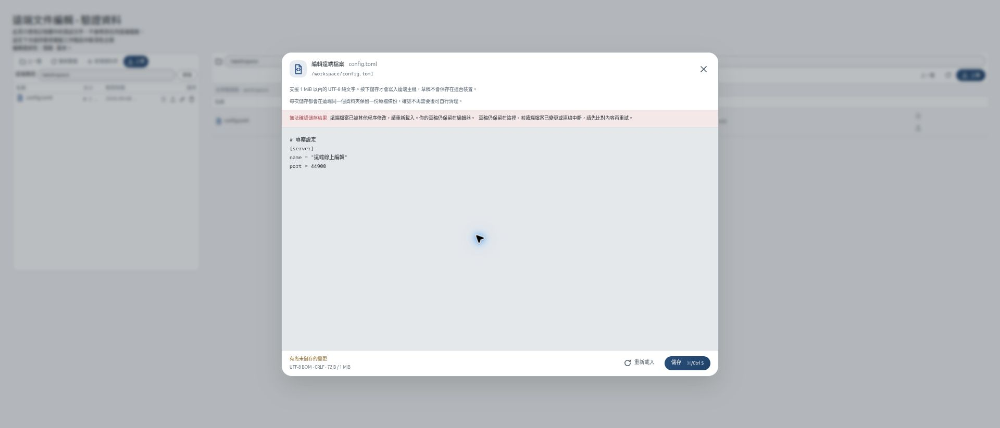
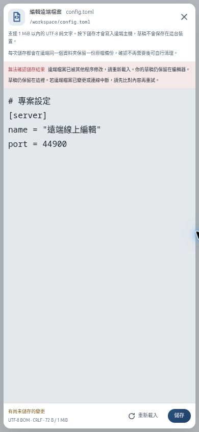

# 遠端純文字編輯

在 SSH 附屬檔案總管、SFTP 工作階段或新版 Lattice Remote 檔案頁，按檔案列的「編輯文字」。檔名原本的下載行為不變，二進位文件仍可下載到本機處理。

## 操作

- 支援最大 1 MiB 的 UTF-8 一般檔案，例如 `.txt`、Markdown、JSON、TOML、設定檔及原始碼。拒絕無效 UTF-8、二進位控制字元、符號連結及特殊檔案。
- 保留 UTF-8 BOM 和原有 LF 或 CRLF，不會因 textarea 正規化換行而悄悄重寫格式。混合換行與單獨 CR 暫不支援；Word／PDF 不是純文字編輯範圍。
- 修改後按「儲存」或 Ctrl／⌘+S。關閉或重新載入時若有未儲存內容，會先詢問。儲存失敗仍保留草稿；儲存期間新輸入的內容不會被較早的回覆蓋掉。
- 編輯器與應用程式更新安裝互斥：更新下載／安裝或重啟已開始時不能開啟編輯器；編輯器開啟期間不能啟動更新。先完成或關閉編輯，再進行更新，避免自動重啟遺失草稿。
- 每次保存會留下遠端原檔備份：SFTP 使用同資料夾的隱藏備份檔，Lattice Remote 使用同資料夾下的私有 `.latticeterm-edit-backup-*` 子目錄。成功訊息顯示備份路徑；確認檔案與其他程序皆正常後，再自行清理，應用程式不會自動刪除這些原件。
- SFTP 檔案若有 group／other 權限，每次儲存前需額外確認存取權限風險；未確認時後端拒絕寫入。這不是保證 ACL 不變：新檔可能繼承父目錄 ACL，讓其他帳號取得存取權。有敏感內容、特殊 ACL 或不確定時請取消，改用主機端編輯器。owner-only 檔案保留原有私有權限，不需要這個額外確認。
- 應用程式不另存本機草稿。斷線後編輯器仍保留，但不能用已失效的連線儲存；請先自行複製草稿，重新連線並重讀遠端檔後再合併。應用程式強制退出或系統中斷仍會失去未儲存草稿；已開始儲存的內容可能留在遠端暫存檔或復原檔中。

## 版本與授權

SFTP 不需再次登入，也不執行 shell 指令，只使用現有已通過主機金鑰驗證的連線。這項介面能力不會擴大 MCP 的核准根目錄或上下載權限。

Lattice Remote 兩端需有支援文字編輯的版本；分享端仍須明確授權檔案分享。Hello 的可選 `file_edit` 能力缺席時，檢視端不傳新的編輯指令，仍可使用舊版上下載。螢幕唯讀和檔案分享是獨立權限，因此唯讀桌面仍可在已授權的分享資料夾編輯。

Lattice Remote 文字編輯目前限 Linux／macOS **分享端**。Windows 分享端因尚未可靠保留檔案安全描述元而不宣告編輯能力，後端亦拒絕儲存；上下載維持可用。Windows **連線端**可編輯支援的 Linux／macOS 分享端。SFTP 是另一套能力，依伺服器提供的 POSIX 中繼資料判斷是否可以編輯，不等同原生 Windows ACL 保留。

## 儲存與安全邊界

讀取有前後中繼資料檢查，內容大小有界。revision 包含內容 SHA-256 與檔案中繼資料，不只依賴修改時間，因此同大小、同時間戳的內容變更也會被偵測。

儲存前再次核對 revision；新內容先完整寫入暫存檔，關閉與驗證成功後才移動原件。原件移至備份後再驗證一次，接著以不覆蓋新出現目標的方式發布。失敗會嘗試不覆蓋的回復，不能回復時回報原件位置。成功後仍保留原件，可追回已開啟舊檔 handle 的其他程序後續寫入。

這不是一般檔案系統或 SFTP 不具備的原子 compare-and-swap：替換中間可能短暫沒有目標檔名，不能與外部寫入者無條件同時操作，也不能保證對惡意本機程序的父目錄替換競態完全隔離。僅對可信主機及可信目錄管理者使用，重要設定檔請選維護時段。逾時或斷線可能發生在遠端已提交、但回覆尚未抵達之後；不要盲目重試，先保留草稿並重新讀取確認結果。

SFTP 保留並核對 POSIX owner／group／mode，儲存時拒絕唯讀、特殊權限位元或缺少必要中繼資料的檔案。但 SFTP v3 沒有通用 inode、hardlink、ACL、extended attributes 或原子 CAS API；不能保證保留 ACL／hardlink 關係。server 沒有 fsync 擴充時也不能宣稱斷電耐久性。Lattice Remote 拒絕 hardlink、符號連結，儲存時亦拒絕唯讀與特殊權限檔案，並重驗分享根目錄和父目錄；原檔仍保留供復原。需要完整特殊 ACL／檔案屬性語意的文件應使用主機端工具。

Lattice Remote 的 Linux／macOS 分享端會拒絕偵測到的檔案擴充屬性、特殊 ACL／父目錄繼承 ACL，避免用一般權限替換特殊安全語意；不能檢查時不保存。

## 驗證邊界

前端測試涵蓋文字格式、大小、未儲存保護、讀寫非同步回覆及失敗草稿。後端測試涵蓋有界串流、版本衝突、唯讀／連結／二進位拒絕、權限檢查與可恢復保存；SFTP 另使用拋棄式本機 OpenSSH sftp-server 測試，不連使用者的主機。跨平台 CI 與已安裝應用程式屬於另外的驗證邊界，不以本機測試代替。

介面截圖使用記憶體中的測試文件；不是對使用者遠端主機操作的紀錄。

