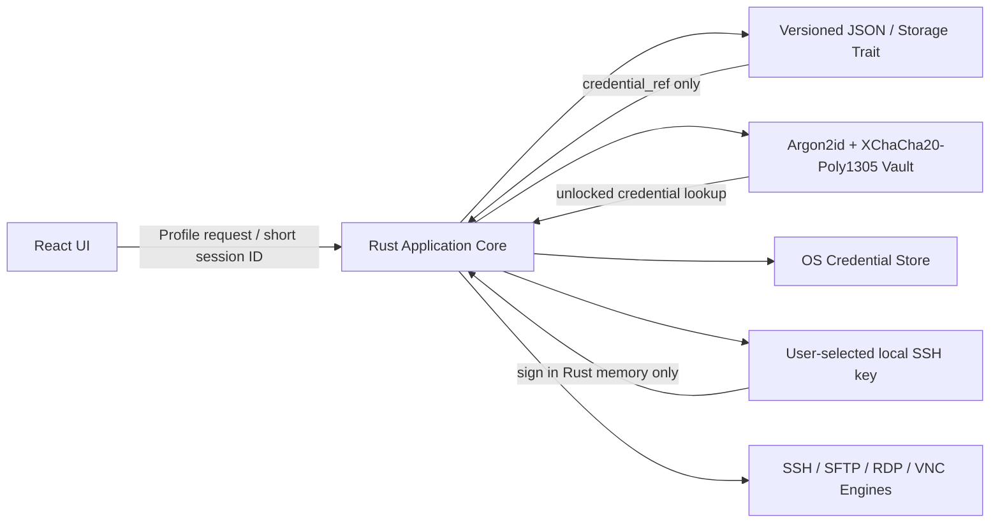

# LatticeTerm 本機儲存與安全架構決策

文件版本：1.4
更新日期：2026-08-22
狀態：Accepted / Phase 3 Core Implemented

---

## 1. 核心結論與分層儲存架構

LatticeTerm 採取明確的資料分類與分層儲存策略：

- **非機密中繼資料層**：連線設定、顯示名稱、協定、連接埠、群組、標籤與 UI 偏好。目前透過版本化 `Storage` trait 與逐檔原子替換的 JSON 保存；若未來資料量或查詢需求增加，可在不改領域模型的前提下評估純 Rust 嵌入式資料庫。
- **安全金鑰與憑證保管庫 (Key Vault)**：以 `known_hosts.json` 管理主機信任，並提供兩種認證後端：作業系統認證儲存區，以及以 Argon2id 衍生金鑰、XChaCha20-Poly1305 密封整包內容的主密碼加密保管庫。
- **系統憑證保護層 (OS Credential Store)**：已使用 Windows Credential Manager、macOS Keychain 與 Linux Secret Service 保存使用者明確選擇的密碼；這是桌面預設後端，加密保管庫則供沒有可用系統鑰匙圈或需要可攜式本機保護的情境。
- **SSH 私鑰認證**：只在使用者連線時從明確選擇的本機路徑讀取並簽章，不把私鑰內容或 Passphrase 複製到 Profile、前端持久層或目前的認證儲存區。
- **分層備份與匯出**：以結構化 JSON 提供非機密連線設定匯出與匯入；完整工作區可另存為經 Argon2id 與 XChaCha20-Poly1305 保護的可攜式備份。作業系統認證儲存區與外部私鑰維持裝置邊界，不進入備份。

---

## 2. 儲存架構流程

---

## 3. 資料分級規範

| 資料等級 | 資料範例 | 安全與儲存要求 |
|---|---|---|
| **一般中繼資料** | 顯示名稱、協定、連接埠、群組、標籤、環境標記、外觀設定 | 儲存於版本化中繼資料層；目前使用原子 JSON，支援驗證、遷移與安全匯出 |
| **敏感資產資訊** | 主機名稱、IP 位址、使用者名稱、連線活動紀錄 | 不可進入遠端診斷日誌，支援非機密 JSON 匯出 |
| **使用者產生的媒體** | 遠端 Canvas 的 PNG 截圖、WebM／MP4 錄影 | 僅在使用者主動擷取時產生；下載前暫存於 WebView 記憶體，不進應用程式資料目錄或設定匯出 |
| **機密與信任根** | 密碼、Token、私鑰 bytes、Passphrase、配對碼、主機金鑰指紋 | 必須靜態加密與完整性保護，禁止寫入前端持久層；複製的一次性配對碼套用可調整的內容比對清除策略 |

---

## 4. 實作進度與規劃

### Phase 1：安全資料邊界 (已完成 ✅)
- 建立純 Rust `domain` 領域模型與 `Storage` trait 抽象層。
- 前端 Profile 嚴格僅保存中繼資料與組織設定，不含任何機密欄位。
- 實作安全非機密 JSON 匯出與匯入驗證器。

### Phase 2：Key Vault 與主機指紋信任 (已完成 ✅)
- 已完成主機指紋核對對話框（Unknown host fingerprint）與金鑰變更警告（Changed host key）。
- 已完成 `known_hosts.json` 持久化，以及 Key Vault 內真實資料的列出、搜尋、手動新增與確認移除。
- 網頁預覽不顯示範例信任資料；信任檔讀不到時維持安全失敗，不退化成空清單。
- 已完成系統金鑰庫（Keyring）整合；只有使用者明確勾選且驗證成功的 SSH／SFTP／RDP／VNC 密碼、已儲存永久裝置 ID 的 Lattice Relay 檢視端配對碼，或中繼分享端明確選擇保存的固定密碼才會寫入，前端只能查詢是否存在或要求刪除，不能讀取明文。
- 已完成主密碼加密保管庫；KDF 使用 Argon2id（64 MiB、3 次迭代），內容以 XChaCha20-Poly1305 驗證加密，支援建立、解鎖、手動鎖定、改主密碼與認證後端切換。主密碼、衍生金鑰與解密內容不寫入前端持久層。
- 已完成 SSH 私鑰認證；私鑰由使用者指定本機路徑，內容與 Passphrase 不會保存。
- 已完成保管庫的全域閒置與背景自動鎖定；預設閒置 15 分鐘或視窗進入背景時清除記憶體中的衍生金鑰與解密內容，使用者可調整閒置期限、停用個別策略，亦可隨時手動鎖定。應用程式重啟後仍維持鎖定。
- 已完成敏感剪貼簿保護；Lattice Remote 配對碼預設複製 30 秒後清除，可選 15／60／120 秒或停用。Rust 原生層只保存 SHA-256 摘要並在逾時、使用者要求或應用程式離開時比對內容，相符才清除；WebView 不取得 clipboard plugin 的任意權限。終端機只在使用者明確複製／貼上時透過獨立原生命令交換最多 1 MiB 的純文字，讓拒絕 `navigator.clipboard` 的 Linux WebKitGTK 仍可操作；瀏覽器預覽則沿用瀏覽器 API。Agent 圖片貼上會先驗證目標工作階段、邊長、像素數及 RGBA 長度，每個工作階段最多保留 32 張／256 MiB；暫存檔只允許擁有者存取，並在工作階段停止、自然結束或應用程式離開時刪除。
- SSH／SFTP／RDP／VNC 密碼預設只供單次連線；只有使用者明確選擇記住且驗證成功後才存入選定認證後端。內嵌 Lattice Remote 直連碼只留在程序／WebView 記憶體並於配對後清除；已儲存且具永久裝置 ID 的 Relay 檢視端連線可由使用者明確選擇保存配對碼，Rust 核心只在 Noise 交握成功後寫入安全認證後端，並將密文項目同時綁定連線設定檔及正規化裝置 ID。
- 中繼分享端只能保存使用者明確輸入的固定密碼。Rust 核心把認證綁定永久裝置 ID，確認啟動的 Agent 回報同一身分後才保存；明文不寫入 WebView settings、程序參數或日誌，只經 stdin 傳給 sidecar。`credential_backend.json` 以非秘密權威標記指向主機密碼後端，並以 `remoteHostCleanupPending` 持久記錄尚待實體清理的後端；主機載入只信任標記指向處，絕不使用一般認證的跨後端 fallback。輪替先耐久撤銷原生載入並將兩端寫入清理日誌，再寫入選定後端，最後才以原子替換啟用新標記。刪除也先清標記並記錄兩端待清理，再刪實體副本；中途失敗時副本仍不可達，介面會顯示狀態並允許在後端恢復可用後重試。OS Credential Store 可在應用程式重啟後直接取用；加密保管庫重啟後維持鎖定，必須先解鎖才能重新啟動分享。刪除認證與主機重新設定共用鎖；刪除後已執行中的 Agent 仍持有記憶體內密碼，但只到本次停止或應用程式重啟為止。
- 後續使用已儲存配對碼或固定密碼時，明文不會傳回 WebView；刪除裝置設定前也必須先從 Key Vault 移除該認證。獨立常駐 Agent 與 `lattice-remote` CLI 自動化應改用權限限定為擁有者、非符號連結的 `--pair-code-file`；CLI 刻意不接受命令列配對碼，讀入並完成 Noise 交握後會清除原字串。中繼位址屬非機密設定，可保存於前端；永久裝置身分含註冊 token 與 Noise 私鑰，Unix 上強制為 `0600`；該檔在首次讀取時才建立，因此只有在使用者於分享對話框選擇中繼模式後才會產生，從未使用 Lattice Remote 或只用區網直連的人不會被建立這份金鑰。Relay 檢視端的釘選檔只有公開金鑰指紋，GUI 與 CLI 共用並以跨程序鎖及原子替換更新。RDP／VNC 密碼只以 stdin 傳入每工作階段獨立的 engine。
- RDP 自簽憑證信任也是當次重試限定，不寫入 profile 或 `known_hosts.json`。

### Phase 3：加密備份與跨平台遷移（核心已完成 ✅）
- 已提供整庫加密匯出與還原（`*.latticeterm-backup`）。WebView 只收加密信封，不產生明文暫存檔；密碼以 Argon2id（64 MiB、3 次迭代）衍生，payload 以 XChaCha20-Poly1305 驗證加密。
- 僅接受明確 allowlist：`connections.json`、`known_hosts.json`、`agent-workspaces.json`、`credential_backend.json`、`vault.json` 與三個版本化 localStorage 設定。`credential_backend.json` 不含密碼；匯出時只保留一般認證的偏好後端，刻意移除主機密碼權威標記與 `remoteHostCleanupPending` 本機清理日誌。allowlist 外項目、超限內容、符號連結與無效資料一律拒絕；正式解析器可忽略已知檔案裡供向前相容的額外欄位。
- 還原前先在隔離暫存目錄以正式 Store 解析器驗證，發布時採逐檔原子替換；重新載入失敗會回滾原資料。匯出依序取得 Remote host `start_lock` → credential backend 檔案鎖 → Vault 鎖；還原在 Remote host 鎖後多取 SSH tunnel restore barrier，再進 backend 與 Vault。barrier 會把最終通道檢查與資料取代包成同一個無新啟動區段，保管庫必須鎖定，且所有 SSH 通道必須停止。
- 還原一律不重啟備份裡的主機密碼授權：權威標記維持清空，兩個本機後端都記入持久清理日誌，原生狀態將當前 Agent 標成未保存，前端隨之關閉下次 `useSavedPairingCode`。還原不中斷已執行 Agent，但它只能沿用本次記憶體密碼到停止或應用程式重啟。
- OS Credential Store 密碼、外部 SSH 私鑰、工作階段輸出、截圖與錄影不在備份範圍內；使用者必須在新裝置重新提供這些裝置綁定資料。
- 備份格式與密碼學流程已有 Linux 單元測試；Windows、macOS 的正式安裝包 smoke test 仍由每次跨平台 Release workflow 持續驗證。
